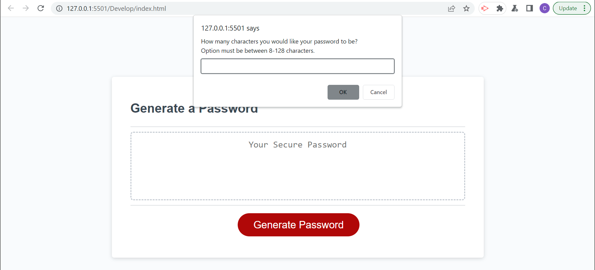

# JavaScript Password Generator (JPG)

## Description
AS AN employee with access to sensitive data  
I WANT to randomly generate a password that meets certain criteria  
SO THAT I can create a strong password that provides greater security  
  
A JavaScript Password Generator has been created to meet these needs.

## Screenshot

## Acceptance Criteria
GIVEN I need a new, secure password  
WHEN I click the button to generate a password  
THEN I am presented with a series of prompts for password criteria  
WHEN prompted for password criteria  
THEN I select which criteria to include in the password  
WHEN prompted for the length of the password  
THEN I choose a length of at least 8 characters and no more than 128 characters  
WHEN asked for character types to include in the password  
THEN I confirm whether or not to include lowercase, uppercase, numeric, and/or special characters  
WHEN I answer each prompt  
THEN my input should be validated and at least one character type should be selected  
WHEN all prompts are answered  
THEN a password is generated that matches the selected criteria  
WHEN the password is generated  
THEN the password is either displayed in an alert or written to the page  

## Installation
N/A

## Usage
When the user clicks "Generate Password", a prompt box will appear with instructions to generate a secure 8-128 character password with user's choice of a combination of uppercase and lowercase letters, numbers, and special characters.

## Credits
N/A

## License
Please refer to the LICENSE in the repo.